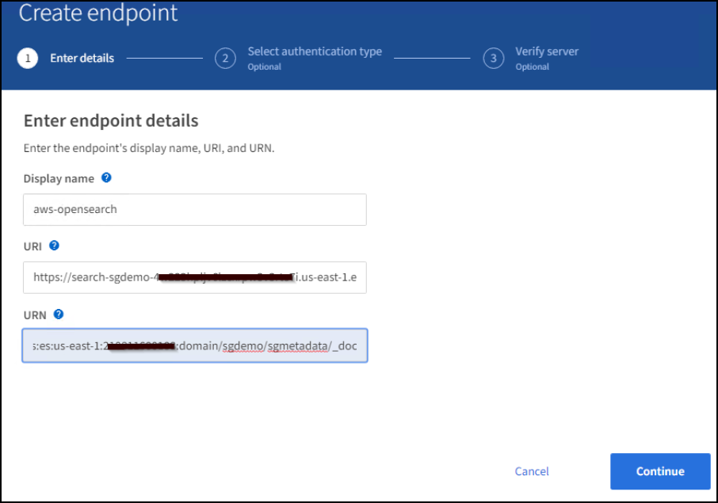
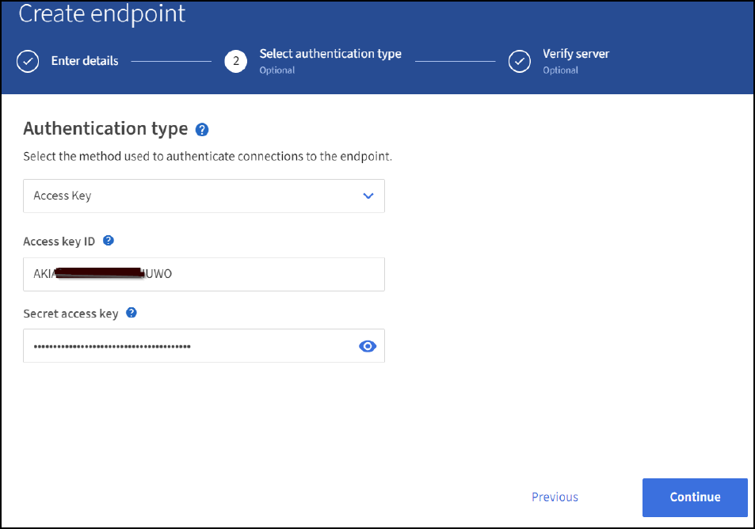
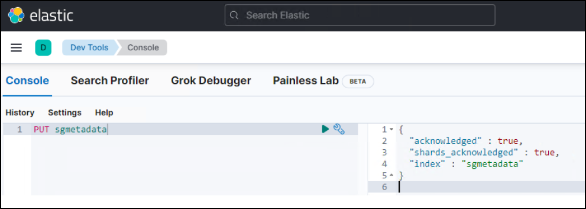

= StorageGRID 검색 통합 서비스를 구성합니다
:allow-uri-read: 

_ Angela Cheng _

[role="lead"]
이 가이드는 NetApp StorageGRID 11.6 검색 통합 서비스를 Amazon OpenSearch Service 또는 사내 Elasticsearch와 구성하기 위한 자세한 지침을 제공합니다.

== 소개

StorageGRID는 세 가지 유형의 플랫폼 서비스를 지원합니다.

* * StorageGRID CloudMirror 복제 *. StorageGRID 버킷에서 지정된 외부 대상으로 특정 객체를 미러링합니다.
* * 알림 *. 객체에서 수행한 특정 작업에 대한 알림을 지정된 외부 Amazon SNS(Amazon Simple Notification Service)로 보내는 버킷당 이벤트 알림입니다.
* * 통합 서비스 검색 *. S3(Simple Storage Service) 개체 메타데이터를 지정된 Elasticsearch 인덱스에 전송하여 외부 서비스를 사용하여 메타데이터를 검색하거나 분석할 수 있습니다.

플랫폼 서비스는 테넌트 관리자 UI를 통해 S3 테넌트에서 구성합니다. 자세한 내용은 을 참조하십시오 https://["플랫폼 서비스 사용에 대한 고려 사항"^].

이 문서는 에 대한 보충 자료로 사용됩니다 https://["StorageGRID 11.6 테넌트 가이드"^] 및 에서는 검색 통합 서비스를 위한 엔드포인트 및 버킷 구성에 대한 단계별 지침과 예제를 제공합니다. 여기에 포함된 AWS(Amazon Web Services) 또는 온프레미스 Elasticsearch 설정 지침은 기본 테스트 또는 데모 전용입니다.

대상 고객은 그리드 관리자, 테넌트 관리자에 익숙해야 하며, StorageGRID 검색 통합 테스트를 위한 기본 업로드(PUT) 및 다운로드(GET) 작업을 수행하기 위해 S3 브라우저에 액세스할 수 있어야 합니다.

== 테넌트 생성 및 플랫폼 서비스 활성화

. Grid Manager를 사용하여 S3 테넌트를 생성하고 표시 이름을 입력한 다음 S3 프로토콜을 선택합니다.
. 사용 권한 페이지에서 플랫폼 서비스 허용 옵션을 선택합니다. 필요한 경우 다른 사용 권한을 선택합니다.
+

. 테넌트 루트 사용자 초기 암호를 설정하거나, 격자에서 페더레이션 식별 이 설정된 경우 테넌트 계정을 구성할 루트 액세스 권한이 있는 통합 그룹을 선택합니다.
. 루트로 로그인 을 클릭하고 버킷:버킷 생성 및 관리 를 선택합니다.
+
그러면 Tenant Manager 페이지로 이동합니다.

. Tenant Manager에서 내 액세스 키를 선택하여 나중에 테스트할 S3 액세스 키를 생성하고 다운로드합니다.

== Amazon OpenSearch로 통합 서비스를 검색합니다

=== Amazon OpenSearch(이전의 Elasticsearch) 서비스 설정

테스트/데모용으로만 OpenSearch 서비스를 빠르고 간편하게 설정하려면 이 절차를 사용하십시오. 온-프레미스 Elasticsearch를 사용하여 검색 통합 서비스를 사용하는 경우 섹션을 참조하십시오 xref:search-integration-services-with-on-premises-elasticsearch[온-프레미스 Elasticsearch와 통합 서비스를 검색합니다].

NOTE: OpenSearch 서비스에 가입하려면 유효한 AWS 콘솔 로그인, 액세스 키, 비밀 액세스 키 및 권한이 있어야 합니다.

. 의 지침에 따라 새 도메인을 만듭니다 link:https://docs.aws.amazon.com/opensearch-service/latest/developerguide/gsgcreate-domain.html["AWS OpenSearch 서비스 시작"^]다음 사항을 제외한 경우:
+
** 4단계. 도메인 이름: sgdemo
** 10단계. 세분화된 액세스 제어: 세분화된 액세스 제어 사용 옵션을 선택 취소합니다.
** 12단계. 액세스 정책: 레벨 액세스 정책 구성을 선택하고 JSON 탭을 선택하여 다음 예를 사용하여 액세스 정책을 수정합니다.
+
*** 강조 표시된 텍스트를 사용자 고유의 AWS ID 및 액세스 관리(IAM) ID 및 사용자 이름으로 바꿉니다.
*** 강조 표시된 텍스트(IP 주소)를 AWS 콘솔에 액세스하는 데 사용한 로컬 컴퓨터의 공용 IP 주소로 바꿉니다.
*** 브라우저 탭을 에 엽니다 https://["https://checkip.amazonaws.com"^] 공용 IP를 찾습니다.
+
[source, json]
----
{

    "Version": "2012-10-17",
    "Statement": [
        {
        "Effect": "Allow",
        "Principal":
        {"AWS": "arn:aws:iam:: nnnnnn:user/xyzabc"},
        "Action": "es:*",
        "Resource": "arn:aws:es:us-east-1:nnnnnn:domain/sgdemo/*"
        },
        {
        "Effect": "Allow",
        "Principal": {"AWS": "*"},
        "Action": [
        "es:ESHttp*"
                ],
        "Condition": {
            "IpAddress": {
                "aws:SourceIp": [ "nnn.nnn.nn.n/nn"
                    ]
                }
        },
        "Resource": "arn:aws:es:us-east-1:nnnnnn:domain/sgdemo/*"
        }
    ]
}
----
+
image::../media/storagegrid-search-integration-service/sg-sis-search-integration-amazon-opensearch.png[검색 통합 스크린샷]

. 도메인이 활성화될 때까지 15-20분 정도 기다립니다.
+

. OpenSearch Dashboards URL 을 클릭하여 새 탭에서 도메인을 열고 대시보드에 액세스합니다. 액세스 거부 오류가 발생하면 도메인 대시보드에 액세스할 수 있도록 액세스 정책 원본 IP 주소가 컴퓨터 공용 IP로 올바르게 설정되어 있는지 확인합니다.
. 대시보드 시작 페이지에서 직접 탐색 을 선택합니다. 메뉴에서 관리 -> 개발 도구 로 이동합니다
. 개발 도구 -> 콘솔에서 StorageGRID 개체 메타데이터를 저장하기 위해 인덱스를 사용하는 'Put <index>'를 입력합니다. 다음 예에서는 인덱스 이름 'gmetadata'를 사용합니다. 작은 삼각형 기호를 클릭하여 PUT 명령을 실행합니다. 다음 예제 스크린샷과 같이 오른쪽 패널에 예상 결과가 표시됩니다.
+

. 색인이 sgdomain > Indices 아래의 Amazon OpenSearch UI에서 표시되는지 확인합니다.
+
image::../media/storagegrid-search-integration-service/sg-sis-verifying-the-index.png[verifying-the-index 스크린샷]

== 플랫폼 서비스 엔드포인트 구성

플랫폼 서비스 끝점을 구성하려면 다음 단계를 수행하십시오.

. 테넌트 관리자 에서 스토리지(S3) > 플랫폼 서비스 엔드포인트 로 이동합니다.
. 끝점 만들기 를 클릭하고 다음을 입력한 다음 계속 을 클릭합니다.
+
** 표시 이름 예 AWS-OpenSearch
** 예제 스크린샷의 도메인 끝점은 URI 필드의 이전 절차의 2단계 아래에 있습니다.
** URN 필드의 이전 절차 2단계에서 사용한 ARN 도메인을 ARN의 끝에 추가하는 /<index>/_doc'를 추가한다.
+
이 예에서 URN은 'arn:aws:es:us-east-1:211234567890:domain/sgdemo/sgmedata/_doc'가 됩니다.

+

. Amazon OpenSearch sgdomain에 액세스하려면 인증 유형으로 Access Key를 선택한 다음 Amazon S3 액세스 키와 암호 키를 입력합니다. 다음 페이지로 이동하려면 계속 을 클릭합니다.
+

. 끝점을 확인하려면 운영 체제 CA 인증서 사용 및 끝점 테스트 및 만들기 를 선택합니다. 확인이 성공하면 다음 그림과 유사한 엔드포인트 화면이 표시됩니다. 확인이 실패하면 경로 끝에 URN에 "/<index>/_doc"가 포함되어 있고 AWS 액세스 키와 비밀 키가 올바른지 확인합니다.
+
image::../media/storagegrid-search-integration-service/sg-sis-platform-service-endpoints.png[플랫폼 서비스 끝점 스크린샷]

== 온-프레미스 Elasticsearch와 통합 서비스를 검색합니다

=== 온-프레미스 Elasticsearch 설정

이 절차는 테스트 목적으로만 Docker를 사용하여 사내 Elasticsearch 및 Kibana를 빠르게 설정하기 위한 것입니다. Elasticsearch 및 Kibana 서버가 이미 있는 경우 5단계로 이동합니다.

. 다음 단계를 따르십시오 link:https://docs.docker.com/engine/install/["Docker 설치 절차"^] Docker를 설치합니다. 을 사용합니다 link:https://docs.docker.com/engine/install/centos/["CentOS Docker 설치 절차"^] 를 클릭합니다.
+
--
....
sudo yum install -y yum-utils
sudo yum-config-manager --add-repo https://download.docker.com/linux/centos/docker-ce.repo
sudo yum install docker-ce docker-ce-cli containerd.io
sudo systemctl start docker
....
--
+
** 재부팅 후 Docker를 시작하려면 다음을 입력합니다.
+
--
 sudo systemctl enable docker
--
** VM.max_map_count 값을 262144로 설정한다.
+
--
 sysctl -w vm.max_map_count=262144
--
** 재부팅 후 설정을 유지하려면 다음을 입력합니다.
+
--
 echo 'vm.max_map_count=262144' >> /etc/sysctl.conf
--

. 를 따릅니다 link:https://www.elastic.co/guide/en/elasticsearch/reference/current/getting-started.html["Elasticsearch 빠른 시작 가이드"^] Elasticsearch 및 Kibana Docker를 설치하고 실행하기 위한 자가 관리 섹션입니다. 이 예에서는 버전 8.1을 설치했습니다.
+

TIP: 참고 Elasticsearch에서 만든 사용자 이름/암호 및 토큰을 아래로 하여 Kibana UI 및 StorageGRID 플랫폼 엔드포인트 인증을 시작해야 합니다.

+
image::../media/storagegrid-search-integration-service/sg-sis-search-integration-elasticsearch.png[검색 통합 탄력검색 스크린샷]

. Kibana Docker 컨테이너가 시작되면 URL 링크 '\https://0.0.0.0:5601` 가 콘솔에 표시됩니다. 0.0.0.0을 URL의 서버 IP 주소로 바꿉니다.
. 사용자 이름 탄력성과 이전 단계에서 Elastic에 의해 생성된 암호를 사용하여 Kibana UI에 로그인합니다.
. 처음 로그인하는 경우 대시보드 시작 페이지에서 직접 탐색 을 선택합니다. 메뉴에서 관리 > 개발 도구 를 선택합니다.
. 개발 도구 콘솔 화면에서 StorageGRID 개체 메타데이터를 저장하기 위해 이 인덱스를 사용하는 "Put <index>"를 입력합니다. 이 예에서는 인덱스 이름 'gmetadata'를 사용합니다. 작은 삼각형 기호를 클릭하여 PUT 명령을 실행합니다. 다음 예제 스크린샷과 같이 오른쪽 패널에 예상 결과가 표시됩니다.
+

== 플랫폼 서비스 엔드포인트 구성

플랫폼 서비스에 대한 끝점을 구성하려면 다음 단계를 수행하십시오.

. 테넌트 관리자에서 스토리지(S3) > 플랫폼 서비스 엔드포인트로 이동합니다
. 끝점 만들기 를 클릭하고 다음을 입력한 다음 계속 을 클릭합니다.
+
** 이름 표시 예: 탄력적인 검색
** Uri:'\https://<elasticsearch-server-ip or hostname>:9200'입니다
** urn:'urn:<something>:es:::<some-unique-text>/<index-name>/_doc' 여기서 index-name은 Kibana 콘솔에서 사용한 이름입니다. 예: 'urn:local:es::::sgmd/sgmetadata/_doc'
+
image::../media/storagegrid-search-integration-service/sg-sis-platform-service-endpoint-details.png[플랫폼 서비스 끝점 세부 정보 스크린샷]

. 인증 유형으로 기본 HTTP 를 선택하고 Elasticsearch 설치 프로세스에서 생성된 사용자 이름 'elastic'과 암호를 입력합니다. 다음 페이지로 이동하려면 계속 을 클릭합니다.
+
image::../media/storagegrid-search-integration-service/sg-sis-platform-service-endpoint-authentication-type.png[플랫폼 서비스 끝점 인증 스크린샷]

. 인증서 확인 안 함 및 테스트 및 끝점 만들기 를 선택하여 끝점을 확인합니다. 확인이 성공하면 다음 스크린샷과 유사한 엔드포인트 화면이 표시됩니다. 확인에 실패하면 URN, URI 및 사용자 이름/암호 항목이 올바른지 확인합니다.
+
image::../media/storagegrid-search-integration-service/sg-sis-successfully-verified-endpoint.png[끝점을 확인했습니다]

== 버킷 검색 통합 서비스 구성

플랫폼 서비스 끝점을 만든 후 다음 단계는 개체가 생성, 삭제 또는 해당 메타데이터 또는 태그가 업데이트될 때마다 개체 메타데이터를 정의된 끝점으로 보내도록 버킷 수준에서 이 서비스를 구성하는 것입니다.

다음과 같이 테넌트 관리자를 사용하여 사용자 지정 StorageGRID 구성 XML을 버킷에 적용하여 검색 통합을 구성할 수 있습니다.

. 테넌트 관리자 에서 스토리지(S3) > 버킷 으로 이동합니다
. Create Bucket을 클릭하고 bucket 이름(예: 'gmetadata-test')을 입력한 후 기본 us-east-1 영역을 그대로 사용합니다.
. 계속 > 버킷 생성 을 클릭합니다.
. 버킷 개요 페이지를 표시하려면 버킷 이름을 클릭한 다음 플랫폼 서비스를 선택합니다.
. 검색 통합 활성화 대화 상자를 선택합니다. 제공된 XML 상자에 이 구문을 사용하여 구성 XML을 입력합니다.
+
강조 표시된 URN은 사용자가 정의한 플랫폼 서비스 끝점과 일치해야 합니다. 다른 브라우저 탭을 열어 테넌트 관리자에 액세스하고 정의된 플랫폼 서비스 끝점에서 URN을 복사할 수 있습니다.

+
이 예에서는 접두어를 사용하지 않았습니다. 즉, 이 버킷의 모든 객체에 대한 메타데이터가 이전에 정의된 Elasticsearch 끝점으로 전송됩니다.

+
[listing]
----
<MetadataNotificationConfiguration>
    <Rule>
        <ID>Rule-1</ID>
        <Status>Enabled</Status>
        <Prefix></Prefix>
        <Destination>
            <Urn> urn:local:es:::sgmd/sgmetadata/_doc</Urn>
        </Destination>
    </Rule>
</MetadataNotificationConfiguration>
----
. S3 브라우저를 사용하여 테넌트 액세스/암호 키를 사용하여 StorageGRID에 연결하고, 테스트 객체를 '메타데이터 테스트' 버킷에 업로드하고, 태그나 사용자 지정 메타데이터를 객체에 추가합니다.
+
image::../media/storagegrid-search-integration-service/sg-sis-upload-test-objects.png[테스트 개체 업로드 스크린샷]

. Kibana UI를 사용하여 오브젝트 메타데이터가 sgmetadata의 인덱스에 로드되었는지 확인합니다.
+
.. 메뉴에서 관리 > 개발 도구 를 선택합니다.
.. 왼쪽의 콘솔 패널에 샘플 쿼리를 붙여넣고 삼각형 기호를 클릭하여 실행합니다.
+
다음 예제 스크린샷의 쿼리 1 예제 결과는 네 개의 레코드를 보여 줍니다. 이는 버킷의 오브젝트 수와 일치합니다.

+
[listing]
----
GET sgmetadata/_search
{
    "query": {
        "match_all": { }
}
}
----
+
image::../media/storagegrid-search-integration-service/sg-sis-query1-sample-result.png[쿼리 1 샘플 결과 스크린샷]

+
다음 스크린샷의 쿼리 2 샘플 결과는 태그 유형 jpg의 두 레코드를 보여 줍니다.

+
[listing]
----
GET sgmetadata/_search
{
    "query": {
        "match": {
            "tags.type": {
                "query" : "jpg" }
                }
            }
}
----
+
image::../media/storagegrid-search-integration-service/sg-sis-query-two-sample.png[쿼리 2 샘플]

== 추가 정보를 찾을 수 있는 위치

이 문서에 설명된 정보에 대해 자세히 알아보려면 다음 문서 및/또는 웹 사이트를 검토하십시오.

* https://["플랫폼 서비스란 무엇입니까"^]
* https://["StorageGRID 11.6 문서"^]

