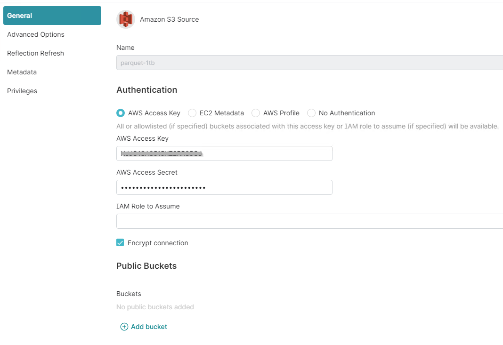

= StorageGRID를 사용하여 Dremio 데이터 소스를 구성합니다
:allow-uri-read: 
:icons: font
:imagesdir: ../media/
:firstname:  Angela
:authorinitials:  C
:lastname: Cheng 
:author:  Angela Cheng 
:authors:  Angela Cheng 

[role="lead"]
Dremio는 클라우드 기반 또는 온프레미스 오브젝트 스토리지를 비롯한 다양한 데이터 소스를 지원합니다.  StorageGRID를 오브젝트 스토리지 데이터 소스로 사용하도록 Dremio를 구성할 수 있습니다.

== Dremio 데이터 소스를 구성합니다

=== 필수 구성 요소

* StorageGRID S3 끝점 URL, 테넌트 S3 액세스 키 ID 및 보안 액세스 키
* StorageGRID 구성 권장 사항: 압축을 사용하지 않도록 설정(기본적으로 해제됨)  를 누릅니다
Dremio는 쿼리 중에 동일한 개체 내에서 다른 바이트 범위를 동시에 가져오기 위해 바이트 범위 GET를 사용합니다.  일반적으로 바이트 범위 요청의 크기는 1MB입니다. 압축된 객체는 바이트 범위 가져오기 성능을 저하시킵니다.

=== Dremio 가이드

https://docs.dremio.com/current/sonar/data-sources/object/s3/["Amazon S3에 연결 - S3 호환 스토리지 구성"^].

== 지침

. Dremio Datasets 페이지에서 + 기호를 클릭하여 소스를 추가하고 'Amazon S3'를 선택합니다.
. 이 새 데이터 소스의 이름, StorageGRID S3 테넌트 액세스 키 ID 및 비밀 액세스 키를 입력합니다.
. StorageGRID S3 끝점에 연결하기 위해 https를 사용하는 경우 '연결 암호화' 확인란을 선택합니다. 를 누릅니다
이 S3 끝점에 대해 자체 서명된 CA 인증서를 사용하는 경우 Dremio 가이드 지침에 따라 이 CA 인증서를 Dremio 서버의 <JAVA_HOME>/JRE/lib/security+에 추가합니다
* 샘플 스크린샷 *
+

. '고급 옵션'을 클릭하고 '호환 모드 사용'을 선택합니다.
. 연결 속성에서 + 속성 추가를 클릭하고 이러한 s3a 속성을 추가합니다.
. FS.s3a.connection. 최대 기본값은 100입니다.  S3 데이터 세트에 100개 이상의 열이 있는 대형 Parquet 파일이 포함된 경우 에서 100보다 큰 값을 입력해야 합니다.  이 설정은 Dremio 가이드를 참조하십시오.
+
[cols="2a,3a"]
|===
| 이름 | 값 

 a| 
FS.s3a.endpoint
 a| 
_<StorageGRID S3 엔드포인트: port> _

 a| 
FS.s3a.path.style.access
 a| 
참

 a| 
FS.s3a.connection.maximum입니다
 a| 
_< 100보다 큰 값 > _

|===
+
* 샘플 스크린샷 *

+
image::../media/dremio/dremio-add-source-advanced.png[새 소스 - 고급 옵션]

. 조직 또는 응용 프로그램 요구 사항에 따라 다른 Dremio 옵션을 구성합니다.
. 이 새 데이터 원본을 만들려면 저장 단추를 클릭합니다.
. StorageGRID 데이터 소스가 성공적으로 추가되면 버킷 목록이 왼쪽 패널에 표시됩니다. 를 누릅니다
* 샘플 스크린샷 *
+
image::../media/dremio/dremio-source-added.png[새 데이터 원본이 추가되었습니다]

