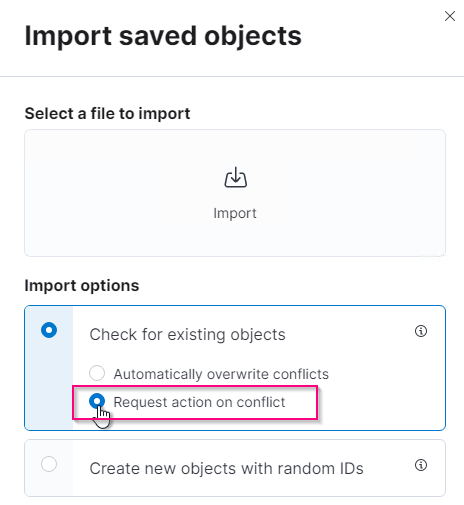

= ELK 스택을 사용한 StorageGRID 로그 분석
:allow-uri-read: 

_ Angela Cheng _

[role="lead"]
StorageGRID 11.6 syslog 전달 기능을 사용하면 외부 syslog 서버를 구성하여 StorageGRID 로그 메시지를 수집하고 분석할 수 있습니다. 엘크(Elasticsearch, Logstash, Kibana)는 가장 인기 있는 로그 분석 솔루션 중 하나가 되었습니다. 를 참조하십시오 https://["ELK 비디오를 사용한 StorageGRID 로그 분석"] 샘플 ELK 구성 및 장애 발생 S3 요청을 식별하고 해결하는 데 사용할 수 있는 방법을 확인합니다. 이 문서에서는 Logstash 구성, Kibana 쿼리, 차트 및 대시보드의 예제 파일을 제공하여 StorageGRID 로그 관리 및 분석을 빠르게 시작할 수 있도록 합니다.

== 요구 사항

* StorageGRID 11.6.0.2 이상
* 엘크(Elasticsearch, Logstash 및 Kibana) 7.1x 이상 설치 및 작동 중

== 샘플 파일

* link:../media/elk-config/elk7-sample.zip["Logstash 7.x 샘플 파일 패키지를 다운로드합니다"] + * MD5 체크섬 * 148c23d0021d9a4b4a6c0287464deab + * SHA256 체크섬 * f51ec9e2e3f842d5a7861566ba561bbbb4373038b4e7b3b3b3d522adf2d6
* link:../media/elk-config/elk8-sample.zip["Logstash 8.x 샘플 파일 패키지를 다운로드합니다"] + * MD5 체크섬 * e11bae3a662f87c310ef363d0fe06835+ * SHA256 체크섬 * 5c670755742cfdf5a723a596ba087e0153a65baef3934afdb682f61cd278d

== 가정

독자는 StorageGRID 및 ELK 용어와 운영에 대해 잘 알고 있습니다.

== 지침

두 가지 샘플 버전은 그로크 패턴으로 정의된 이름의 차이로 인해 제공됩니다. 예를 들어, Logstash 구성 파일의 SYSLOGBASE 그로크 패턴은 설치된 Logstash 버전에 따라 필드 이름을 다르게 정의합니다.

[listing]
----
match => {"message" => '<%{POSINT:syslog_pri}>%{SYSLOGBASE} %{GREEDYDATA:msg-details}'}
----
* Logstash 7.17 샘플 *

image::../media/elk-config/logstash-7.17.fields-sample.png[Logstash 7.17 샘플]

* Logstash 8.23 샘플 *

image::../media/elk-config/logstash-8.x.fields-sample.png[Logstash 8.23 샘플]

* 단계 *

. 설치된 엘크 버전을 기반으로 제공된 샘플의 압축을 풉니다. + 샘플 폴더에는 + * sglog-2-file.conf: * 이 구성 파일은 데이터 변환 없이 Logstash의 파일에 StorageGRID 로그 메시지를 출력합니다. 이 옵션을 사용하여 로그 스타재가 StorageGRID 메시지를 수신하는지 확인하거나 StorageGRID 로그 패턴을 이해하는 데 도움을 줄 수 있습니다. + * sglog-2-es.conf: * 이 구성 파일은 다양한 패턴과 필터를 사용하여 StorageGRID 로그 메시지를 변환합니다. 여기에는 패턴 또는 필터를 기반으로 메시지를 드롭하는 Drop 문 예가 포함되어 있습니다. 인덱싱을 위해 Elasticsearch로 출력이 전송됩니다. + 파일 내의 명령에 따라 선택한 구성 파일을 사용자 지정합니다.
. 사용자 지정 구성 파일 테스트:
+
[listing]
----
/usr/share/logstash/bin/logstash --config.test_and_exit -f <config-file-path/file>
----
+
마지막으로 반환된 줄이 아래 줄과 비슷하면 구성 파일에 구문 오류가 없는 것입니다.

+
[listing]
----
[LogStash::Runner] runner - Using config.test_and_exit mode. Config Validation Result: OK. Exiting Logstash
----
. /etc/logstash/logstash.yml에서 config.reload.automatic 를 활성화하지 않은 경우 Logstash 서버의 config:/etc/logstash/conf.d+에 사용자 지정된 conf 파일을 복사합니다. 그렇지 않으면 구성 다시 로드 간격이 경과될 때까지 기다립니다.
+
[listing]
----
 grep reload /etc/logstash/logstash.yml
# Periodically check if the configuration has changed and reload the pipeline
config.reload.automatic: true
config.reload.interval: 5s
----
. /var/log/logstash/logstash-plain.log 를 확인하고 새 구성 파일로 Logstash를 시작하는 데 오류가 없는지 확인합니다.
. TCP 포트가 시작되고 수신 중인지 확인합니다. + 이 예에서는 TCP 포트 5000이 사용됩니다.
+
[listing]
----
netstat -ntpa | grep 5000
tcp6       0      0 :::5000                 :::*                    LISTEN      25744/java
----
. StorageGRID 관리자 GUI에서 로그 메시지를 Logstash로 보내도록 외부 syslog 서버를 구성합니다. 을 참조하십시오 https://["데모 비디오"] 를 참조하십시오.
. 정의된 TCP 포트에 대한 StorageGRID 노드 연결을 허용하려면 Logstash 서버에서 방화벽을 구성하거나 비활성화해야 합니다.
. Kibana GUI에서 관리 -> 개발 도구 를 선택합니다. 콘솔 페이지에서 이 가져오기 명령을 실행하여 Elasticsearch에 새 인덱스가 생성되었는지 확인합니다.
+
[listing]
----
GET /_cat/indices/*?v=true&s=index
----
. 키바나 GUI에서 인덱스 패턴(엘크 7.x) 또는 데이터 뷰(엘크 8.x)를 생성합니다.
. Kibana GUI의 상단 중앙에 있는 검색 상자에 '저장된 개체'를 입력합니다. + 저장된 개체 페이지에서 가져오기 를 선택합니다. 불러오기 옵션 아래에서 '충돌 시 작업 요청'을 선택합니다.
+

+
ELK <version> -query-chart-sample.ndjson을 가져옵니다. + 충돌을 해결할 것인지 묻는 메시지가 나타나면 8단계에서 만든 색인 패턴이나 데이터 보기를 선택합니다.

+
image::../media/elk-config/kibana-import-conflict.png[키바나 갈등]

+
다음 Kibana 객체를 가져옵니다. + * 쿼리 * + * 감사-메시지 -s3rq -orlm + * bycast 로그 S3 관련 메시지 + * 로그 수준 경고 이상 + * 실패한 보안 이벤트 + * 차트 * + * bycast.log 기반 S3 요청 수 + * HTTP 상태 코드 + * 유형별 감사 메시지 분석 + * 평균 S3 응답 위 차트를 사용하는 시간 + * 대시보드 * + * S3 요청 대시보드

이제 Kibana를 사용하여 StorageGRID 로그 분석을 수행할 준비가 되었습니다.

== 추가 리소스

* https://["syslog101"]
* https://["엘크 스택"]
* https://["Grok 패턴 목록"]
* https://["Logstash:Grok에 대한 초보자용 가이드"]
* https://["Logstash: syslog 심층 탐구 실습 가이드"]
* https://["Kibana 가이드 – 문서 탐색"]
* https://["StorageGRID 감사 로그 메시지 참조"]

