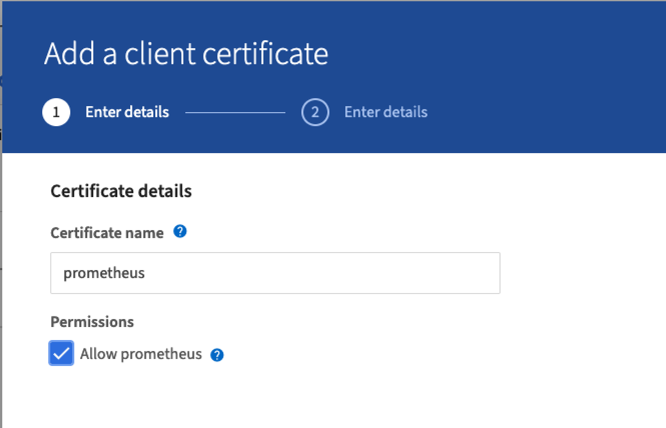
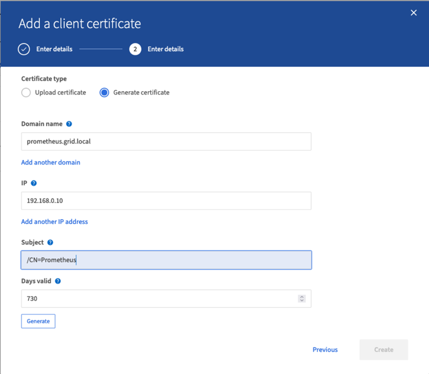
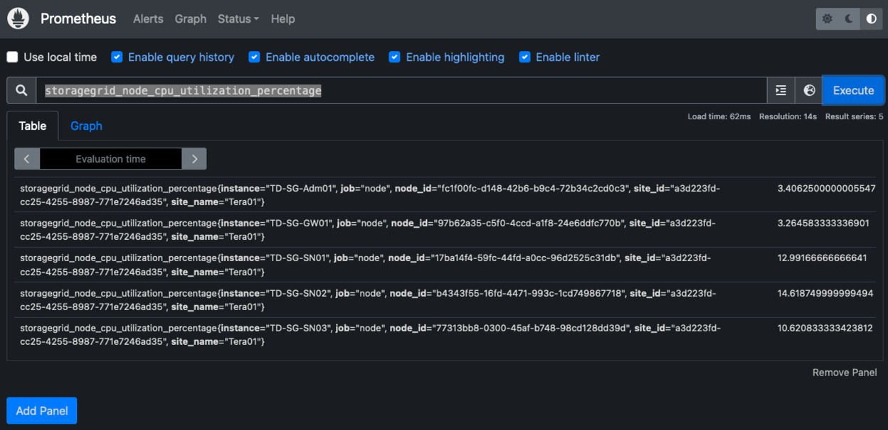
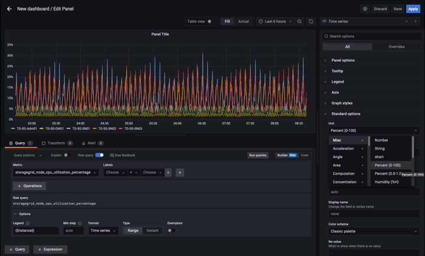
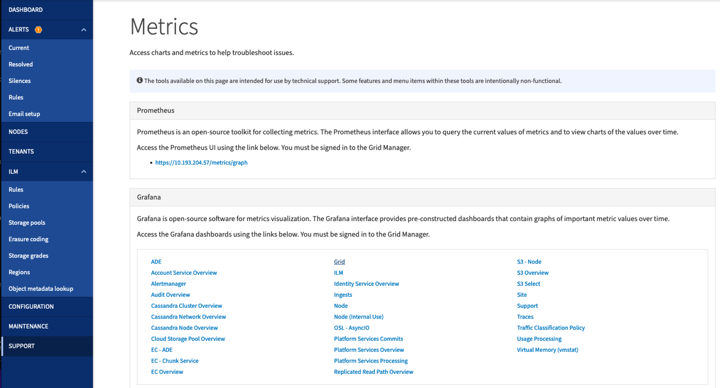

= Prometheus 및 Grafana를 사용하여 메트릭 보존 기간을 연장합니다
:allow-uri-read: 

아론 클라인입니다

[role="lead"]
이 기술 보고서에서는 외부 Prometheus 및 Grafana 서비스를 사용하여 NetApp StorageGRID 11.6을 구성하는 방법에 대해 자세히 설명합니다.

== 소개

StorageGRID는 Prometheus를 사용하여 메트릭을 저장하고 내장된 Grafana 대시보드를 통해 이러한 메트릭의 시각화를 제공합니다. Prometheus 메트릭은 클라이언트 액세스 인증서를 구성하고 지정된 클라이언트에 대한 Prometheus 액세스를 활성화하여 StorageGRID에서 안전하게 액세스할 수 있습니다. 오늘날 이 메트릭 데이터의 보존은 관리 노드의 스토리지 용량에 의해 제한됩니다. 이러한 메트릭의 사용자 지정 시각화를 생성하는 데 더 오랜 시간이 걸릴 뿐만 아니라 사용자 지정 시각화를 만들기 위해 새 Prometheus 및 Grafana 서버를 구축하고, StorageGRID 인스턴스에서 메트릭을 스크레핑하도록 새 서버를 구성하고, 우리에게 중요한 메트릭이 포함된 대시보드를 만들 것입니다. 에서 수집된 Prometheus 메트릭에 대한 자세한 정보를 확인할 수 있습니다 https://["StorageGRID 설명서"^].

== 프로메테우스 연방

=== 실습 세부 정보

이 예제에서는 StorageGRID 11.6 노드와 Debian 11 서버에 모든 가상 시스템을 사용합니다. StorageGRID 관리 인터페이스는 공개적으로 신뢰할 수 있는 CA 인증서로 구성됩니다. 이 예제에서는 StorageGRID 시스템 또는 Debian Linux 설치의 설치 및 구성을 사용하지 않습니다. Prometheus 및 Grafana에서 지원하기를 원하는 Linux의 맛을 사용할 수 있습니다. Prometheus와 Grafana는 모두 Docker 컨테이너로 설치하거나, 소스에서 구축하거나, 사전 컴파일된 바이너리로 구축할 수 있습니다. 이 예제에서는 Prometheus와 Grafana 바이너리를 동일한 Debian 서버에 직접 설치합니다. 의 기본 설치 지침을 다운로드하여 따릅니다 https://[] 및 https://[] 각각

=== Prometheus 클라이언트 액세스를 위해 StorageGRID를 구성합니다

StorageGRID에 저장된 Prometheus 메트릭에 액세스하려면 개인 키가 있는 클라이언트 인증서를 생성하거나 업로드하고 클라이언트에 대한 권한을 활성화해야 합니다. StorageGRID 관리 인터페이스에는 SSL 인증서가 있어야 합니다. 이 인증서는 신뢰할 수 있는 CA에서 또는 자체 서명된 경우 수동으로 신뢰할 수 있는 Prometheus 서버에 의해 신뢰되어야 합니다. 자세한 내용은 를 참조하십시오 https://["StorageGRID 설명서"].

. StorageGRID 관리 인터페이스의 왼쪽 아래에서 "구성"을 선택하고 "보안" 아래의 두 번째 열에서 인증서를 클릭합니다.
. 인증서 페이지에서 "클라이언트" 탭을 선택하고 "추가" 버튼을 클릭합니다.
. 액세스 권한이 부여된 클라이언트의 이름을 제공하고 이 인증서를 사용합니다. "권한" 아래의 "Prometheus 허용" 앞의 상자를 클릭하고 계속 단추를 클릭합니다.
+

. CA 서명 인증서가 있는 경우 "인증서 업로드" 라디오 버튼을 선택할 수 있지만, 여기서는 "인증서 생성" 라디오 버튼을 선택하여 StorageGRID가 클라이언트 인증서를 생성하도록 할 것입니다. 필수 필드가 입력되어 표시됩니다. 클라이언트 서버의 FQDN, 서버의 IP, 제목 및 유효한 날짜를 입력합니다. 그런 다음 "생성" 버튼을 클릭합니다.
+

[NOTE]
====
 Be mindful of the certificate days valid entry as you will need to renew this certificate in both StorageGRID and the Prometheus server before it expires to maintain uninterrupted collection.
====
. 인증서 PEM 파일과 개인 키 PEM 파일을 다운로드합니다.
+
image::../media/prometheus/cert_download.png[인증서 다운로드]

[NOTE]
====
 This is the only time you can download the private key, so make sure you do not skip this step.
====

=== Prometheus 설치를 위해 Linux 서버를 준비합니다

Prometheus를 설치하기 전에 Prometheus 사용자, 디렉토리 구조를 사용하여 환경을 준비하고 메트릭 스토리지 위치의 용량을 구성하려고 합니다.

. Prometheus 사용자를 생성합니다.
+
[source, console]
----
sudo useradd -M -r -s /bin/false Prometheus
----
. Prometheus, 클라이언트 인증서 및 메트릭 데이터용 디렉토리를 생성합니다.
+
[source, console]
----
sudo mkdir /etc/Prometheus /etc/Prometheus/cert /var/lib/Prometheus
----
. ext4 파일 시스템을 사용하여 메트릭 보존을 위해 사용 중인 디스크를 포맷했습니다.
+
[listing]
----
mkfs -t ext4 /dev/sdb
----
. 그런 다음 Prometheus 메트릭 디렉토리에 파일 시스템을 마운트했습니다.
+
[listing]
----
sudo mount -t auto /dev/sdb /var/lib/prometheus/
----
. 메트릭 데이터에 사용 중인 디스크의 uuid를 가져옵니다.
+
[listing]
----
sudo ls -al /dev/disk/by-uuid/
   lrwxrwxrwx 1 root root   9 Aug 18 17:02 9af2c5a3-bfc2-4ec1-85d9-ebab850bb4a1 -> ../../sdb
----
. /etc/fstab/에 항목을 추가하면 /dev/sdb 의 uuuid 를 사용하여 재부팅 후에도 마운트가 유지됩니다.
+
[listing]
----
/etc/fstab
UUID=9af2c5a3-bfc2-4ec1-85d9-ebab850bb4a1 /var/lib/prometheus	ext4	defaults	0	0
----

=== Prometheus를 설치하고 구성합니다

이제 서버가 준비되었으므로 Prometheus 설치를 시작하고 서비스를 구성할 수 있습니다.

. Prometheus 설치 패키지의 압축을 풉니다
+
[source, console]
----
tar xzf prometheus-2.38.0.linux-amd64.tar.gz
----
. 바이너리를 /usr/local/bin에 복사하고 소유권을 이전에 만든 Prometheus 사용자로 변경합니다
+
[source, console]
----
sudo cp prometheus-2.38.0.linux-amd64/{prometheus,promtool} /usr/local/bin
sudo chown prometheus:prometheus /usr/local/bin/{prometheus,promtool}
----
. 콘솔 및 라이브러리를 /etc/Prometheus에 복사합니다
+
[source, console]
----
sudo cp -r prometheus-2.38.0.linux-amd64/{consoles,console_libraries} /etc/prometheus/
----
. StorageGRID에서 이전에 다운로드한 클라이언트 인증서 및 개인 키 PEM 파일을 /etc/Prometheus/certs로 복사합니다
. Prometheus 구성 YAML 파일을 생성합니다
+
[source, console]
----
sudo nano /etc/prometheus/prometheus.yml
----
. 다음 설정을 삽입합니다. 작업 이름은 원하는 모든 것이 될 수 있습니다. "-targets:[']"를 관리 노드의 FQDN으로 변경하고 인증서 및 개인 키 파일 이름의 이름을 변경한 경우 TLS_config 섹션이 일치하도록 업데이트하십시오. 그런 다음 파일을 저장합니다. 그리드 관리 인터페이스에서 자체 서명된 인증서를 사용하는 경우 인증서를 다운로드하여 고유한 이름의 클라이언트 인증서와 함께 놓고 TLS_config 섹션에서 ca_file:/etc/Prometheus/cert/UCERT.pem을 추가합니다
+
.. 이 예에서는 alertmanager, cassandra, node 및 StorageGRID로 시작하는 모든 메트릭을 수집합니다. Prometheus 메트릭에 대한 자세한 내용은 에서 확인할 수 있습니다 https://["StorageGRID 설명서"^].
+
[source, yaml]
----
# my global config
global:
  scrape_interval: 60s # Set the scrape interval to every 15 seconds. Default is every 1 minute.

scrape_configs:
  - job_name: 'StorageGRID'
    honor_labels: true
    scheme: https
    metrics_path: /federate
    scrape_interval: 60s
    scrape_timeout: 30s
    tls_config:
      cert_file: /etc/prometheus/cert/certificate.pem
      key_file: /etc/prometheus/cert/private_key.pem
    params:
      match[]:
        - '{__name__=~"alertmanager_.*|cassandra_.*|node_.*|storagegrid_.*"}'
    static_configs:
    - targets: ['sgdemo-rtp.netapp.com:9091']
----

[NOTE]
====
그리드 관리 인터페이스에서 자체 서명된 인증서를 사용하는 경우 인증서를 다운로드하여 고유한 이름의 클라이언트 인증서와 함께 배치합니다. TLS_config 섹션에서 클라이언트 인증서 및 개인 키 줄 위에 인증서를 추가합니다

....
        ca_file: /etc/prometheus/cert/UIcert.pem
....
====
. /etc/Prometheus 및 /var/lib/Prometheus에 있는 모든 파일 및 디렉토리의 소유권을 Prometheus 사용자로 변경합니다
+
[source, console]
----
sudo chown -R prometheus:prometheus /etc/prometheus/
sudo chown -R prometheus:prometheus /var/lib/prometheus/
----
. /etc/systemd/system에서 Prometheus 서비스 파일을 생성합니다
+
[source, console]
----
sudo nano /etc/systemd/system/prometheus.service
----
. 다음 줄을 삽입하고 메트릭 데이터의 보존 기간을 1년으로 설정하는 #- storage.tsdb.retention.time=1y#를 확인합니다. 또는 #- storage.sdb.retention.size=300GiB#를 사용하여 스토리지 제한에 따라 기본 보존을 수행할 수도 있습니다. 메트릭 보존을 설정할 수 있는 유일한 위치입니다.
+
[source, console]
----
[Unit]
Description=Prometheus Time Series Collection and Processing Server
Wants=network-online.target
After=network-online.target

[Service]
User=prometheus
Group=prometheus
Type=simple
ExecStart=/usr/local/bin/prometheus \
        --config.file /etc/prometheus/prometheus.yml \
        --storage.tsdb.path /var/lib/prometheus/ \
        --storage.tsdb.retention.time=1y \
        --web.console.templates=/etc/prometheus/consoles \
        --web.console.libraries=/etc/prometheus/console_libraries

[Install]
WantedBy=multi-user.target
----
. 새 Prometheus 서비스를 등록하려면 시스템 서비스를 다시 로드하십시오. 그런 다음 Prometheus 서비스를 시작하고 활성화합니다.
+
[source, console]
----
sudo systemctl daemon-reload
sudo systemctl start prometheus
sudo systemctl enable prometheus
----
. 서비스가 올바르게 실행되는지 확인합니다
+
[source, console]
----
sudo systemctl status prometheus
----
+
[listing]
----
● prometheus.service - Prometheus Time Series Collection and Processing Server
     Loaded: loaded (/etc/systemd/system/prometheus.service; enabled; vendor preset: enabled)
     Active: active (running) since Mon 2022-08-22 15:14:24 EDT; 2s ago
   Main PID: 6498 (prometheus)
      Tasks: 13 (limit: 28818)
     Memory: 107.7M
        CPU: 1.143s
     CGroup: /system.slice/prometheus.service
             └─6498 /usr/local/bin/prometheus --config.file /etc/prometheus/prometheus.yml --storage.tsdb.path /var/lib/prometheus/ --web.console.templates=/etc/prometheus/consoles --web.con>

Aug 22 15:14:24 aj-deb-prom01 prometheus[6498]: ts=2022-08-22T19:14:24.510Z caller=head.go:544 level=info component=tsdb msg="Replaying WAL, this may take a while"
Aug 22 15:14:24 aj-deb-prom01 prometheus[6498]: ts=2022-08-22T19:14:24.816Z caller=head.go:615 level=info component=tsdb msg="WAL segment loaded" segment=0 maxSegment=1
Aug 22 15:14:24 aj-deb-prom01 prometheus[6498]: ts=2022-08-22T19:14:24.816Z caller=head.go:615 level=info component=tsdb msg="WAL segment loaded" segment=1 maxSegment=1
Aug 22 15:14:24 aj-deb-prom01 prometheus[6498]: ts=2022-08-22T19:14:24.816Z caller=head.go:621 level=info component=tsdb msg="WAL replay completed" checkpoint_replay_duration=55.57µs wal_rep>
Aug 22 15:14:24 aj-deb-prom01 prometheus[6498]: ts=2022-08-22T19:14:24.831Z caller=main.go:997 level=info fs_type=EXT4_SUPER_MAGIC
Aug 22 15:14:24 aj-deb-prom01 prometheus[6498]: ts=2022-08-22T19:14:24.831Z caller=main.go:1000 level=info msg="TSDB started"
Aug 22 15:14:24 aj-deb-prom01 prometheus[6498]: ts=2022-08-22T19:14:24.831Z caller=main.go:1181 level=info msg="Loading configuration file" filename=/etc/prometheus/prometheus.yml
Aug 22 15:14:24 aj-deb-prom01 prometheus[6498]: ts=2022-08-22T19:14:24.832Z caller=main.go:1218 level=info msg="Completed loading of configuration file" filename=/etc/prometheus/prometheus.y>
Aug 22 15:14:24 aj-deb-prom01 prometheus[6498]: ts=2022-08-22T19:14:24.832Z caller=main.go:961 level=info msg="Server is ready to receive web requests."
Aug 22 15:14:24 aj-deb-prom01 prometheus[6498]: ts=2022-08-22T19:14:24.832Z caller=manager.go:941 level=info component="rule manager" msg="Starting rule manager..."
----
. 이제 Prometheus 서버의 UI로 이동할 수 있습니다 http://[] UI를 참조하십시오
+
image::../media/prometheus/prometheus_ui.png[Prometheus UI 페이지]

. "상태" 대상 아래에서 Prometheus.yml에서 구성한 StorageGRID 끝점의 상태를 볼 수 있습니다
+
image::../media/prometheus/prometheus_targets.png[Prometheus 상태 메뉴]

+
image::../media/prometheus/prometheus_target_status.png[Prometheus 대상 페이지]

. 그래프 페이지에서 테스트 쿼리를 실행하고 데이터가 스크레핑되었는지 확인할 수 있습니다. 예를 들어 쿼리 표시줄에 "StorageGrid_node_cpu_Utilization_percentage"를 입력하고 실행 단추를 클릭합니다.
+

== Grafana 설치 및 구성

Prometheus가 설치되고 작동되었으므로 Grafana 설치 및 대시보드 구성으로 이동할 수 있습니다

=== Grafana 인스턴션

. Grafana의 최신 Enterprise Edition을 설치합니다
+
[source, console]
----
sudo apt-get install -y apt-transport-https
sudo apt-get install -y software-properties-common wget
sudo wget -q -O /usr/share/keyrings/grafana.key https://packages.grafana.com/gpg.key
----
. 안정적인 릴리스를 위해 이 리포지토리를 추가합니다.
+
[source, console]
----
echo "deb [signed-by=/usr/share/keyrings/grafana.key] https://packages.grafana.com/enterprise/deb stable main" | sudo tee -a /etc/apt/sources.list.d/grafana.list
----
. 리포지토리를 추가한 후
+
[source, console]
----
sudo apt-get update
sudo apt-get install grafana-enterprise
----
. 새 이식편 서비스를 등록하려면 시스템 서비스를 다시 로드하십시오. 그런 다음 Grafana 서비스를 시작 및 활성화합니다.
+
[source, console]
----
sudo systemctl daemon-reload
sudo systemctl start grafana-server
sudo systemctl enable grafana-server.service
----
. Grafana가 이제 설치 및 실행 중입니다. 브라우저를 열고 HTTP://Prometheus-server:3000을 열면 Grafana 로그인 페이지가 표시됩니다.
. 기본 로그인 자격 증명은 admin/admin이며, 메시지가 표시되면 새 암호를 설정해야 합니다.

=== StorageGRID에 대한 Grafana 대시보드를 생성합니다

Grafana와 Prometheus가 설치 및 실행되었으므로 이제 데이터 소스를 생성하고 대시보드를 구축하여 두 가지를 연결할 시간입니다

. 왼쪽 창에서 "구성"을 확장하고 "데이터 소스"를 선택한 다음 "데이터 소스 추가" 버튼을 클릭합니다
. Prometheus는 최고의 데이터 소스 중 하나가 될 것입니다. 그렇지 않은 경우 검색 표시줄을 사용하여 "Prometheus"를 찾습니다.
. Prometheus 인스턴스의 URL과 Prometheus 간격에 맞게 스크레핑 간격을 입력하여 Prometheus 소스를 구성합니다. Prometheus에서 경고 관리자를 구성하지 않았기 때문에 알림 섹션도 비활성화했습니다.
+
image::../media/prometheus/grafana_prometheus_conf.png[이식편 프로메테우스(Grafana Prometheus) 구성]

. 원하는 설정을 입력한 후 아래로 스크롤하여 "Save & Test(저장 및 테스트)"를 클릭합니다.
. 구성 테스트가 완료되면 탐색 버튼을 클릭합니다.
+
.. 탐색 창에서 Prometheus를 "StorageGrid_node_cpu_Utilization_percentage"로 테스트한 것과 동일한 메트릭을 사용하고 "쿼리 실행" 단추를 클릭할 수 있습니다
+
image::../media/prometheus/grafana_source_explore.png[이식편 프로메테우스(Grafana Prometheus) 지표 살펴보기]

. 이제 데이터 소스가 구성되었으므로 대시보드를 생성할 수 있습니다.
+
.. 왼쪽 창에서 "대시보드"를 확장하고 "+새 대시보드"를 선택합니다.
.. "Add a new panel(새 패널 추가)"을 선택합니다.
.. 메트릭을 선택하여 새 패널을 구성합니다. 다시 "StorageGrid_node_cpu_Utilization_percentage"를 사용하고, 패널 제목을 입력하고, 하단에 있는 "Options"를 확장하고, 범례를 사용자 지정으로 변경하려면 "{{instance}"를 입력하고, 오른쪽 창에 "Standard options"에서 "Unit"을 "Misc/Percent(0-100)"로 설정합니다. 그런 다음 "적용"을 클릭하여 패널을 대시보드에 저장합니다.
+

. 원하는 각 메트릭에 대해 이러한 대시보드를 계속 구축할 수 있지만 다행히 StorageGRID에는 사용자 지정 대시보드에 복사할 수 있는 패널이 포함된 대시보드가 이미 있습니다.
+
.. StorageGRID 관리 인터페이스의 왼쪽 창에서 "지원"을 선택하고 "도구" 열 아래쪽에서 "메트릭"을 클릭합니다.
.. 메트릭스 내에서 중간 열의 맨 위에 있는 "Grid" 링크를 선택하겠습니다.
+

.. Grid 대시보드에서 "Storage Used - Object Metadata" 패널을 선택합니다. 작은 아래쪽 화살표 및 패널 제목 끝을 클릭하여 메뉴를 드롭다운합니다. 이 메뉴에서 "검사" 및 "패널 JSON"을 선택합니다.
+
image::../media/prometheus/storagegrid_dashboard_insp.png[StorageGRID 대시보드]

.. JSON 코드를 복사하고 창을 닫습니다.
+
image::../media/prometheus/storagegrid_panel_inspect.png[StorageGRID JSON을 참조하십시오]

.. 새 대시보드에서 아이콘을 클릭하여 새 패널을 추가합니다.
+
image::../media/prometheus/grafana_add_panel.png[이식편 추가 패널]

.. 변경하지 않고 새 패널을 적용합니다
.. StorageGRID 패널과 마찬가지로 JSON을 검사하십시오. JSON 코드를 모두 제거하고 StorageGRID 패널에서 복사한 코드로 교체합니다.
+
image::../media/prometheus/grafana_panel_inspect.png[이식편 검사 패널]

.. 새 패널을 편집하면 오른쪽에 "migrate(마이그레이션)" 버튼이 있는 Migration(마이그레이션) 메시지가 표시됩니다. 버튼을 클릭한 다음 "적용" 버튼을 클릭합니다.
+
image::../media/prometheus/grafana_panel_edit_menu.png[이식편 편집 패널 메뉴]

+
image::../media/prometheus/grafana_panel_edit.png[이식편 편집 패널]

. 모든 패널이 제자리에 있고 원하는 대로 구성되면 오른쪽 위에 있는 디스크 아이콘을 클릭하여 대시보드를 저장하고 대시보드에 이름을 지정합니다.

=== 결론

이제 Prometheus 서버에 맞춤형 데이터 보존 및 스토리지 용량을 추가할 수 있습니다. 이를 통해 운영 관련 메트릭이 포함된 자체 대시보드를 지속적으로 구축할 수 있습니다. 에서 수집된 Prometheus 메트릭에 대한 자세한 정보를 확인할 수 있습니다 https://["StorageGRID 설명서"^].
